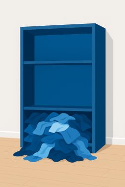
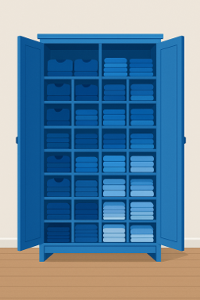
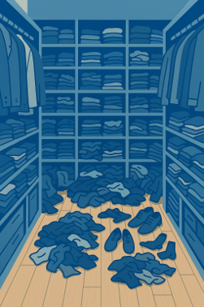

# Learning Objectives

By the end of this lecture, you will be able to:

- Explain the fundamental concepts of caching and its importance
- Compare different cache replacement strategies
- Identify caching principles in everyday life
- Apply caching concepts to personal productivity
- Understand the relationship between caching and attention management

# Introduction

## A Quick Question First

Question: **How many of you have a messy desktop right now?**

**Raise your hand!**

Today's lecture will explain why that matters more than you think...

## Let's approach the topic using an everyday decision

<table>
<colgroup>
<col style="width: 50%" />
<col style="width: 50%" />
</colgroup>
<tbody>
<tr>
<td style="text-align: left;">

<ul>
<li>We have a problem: Our cupboard.</li>
<li>It’s time to put things in order.</li>
</ul>

</td>
<td style="text-align: left;">

</td>
</tr>
</tbody>
</table>

## Question: What could we do?

<table>
<colgroup>
<col style="width: 50%" />
<col style="width: 50%" />
</colgroup>
<tbody>
<tr>
<td style="text-align: left;">

<ul>
<li>Better organization</li>
<li>Clearing out things we no longer need</li>
<li>Now we have two problems:
<ul>
<li>Storing?</li>
<li>Clearing out?</li>
</ul></li>
</ul>

</td>
<td style="text-align: left;">

</td>
</tr>
</tbody>
</table>

## Two Approaches to Storage Problems

<table>
<colgroup>
<col style="width: 50%" />
<col style="width: 50%" />
</colgroup>
<tbody>
<tr>
<td style="text-align: left;">

<ul>
<li><strong>Better Organization:</strong>
<ul>
<li>Subdivide storage</li>
<li>Efficient sorting</li>
</ul></li>
<li><strong>More Space:</strong>
<ul>
<li>Increase capacity</li>
</ul></li>
<li>Question: Which approach is better?</li>
</ul>

</td>
<td style="text-align: left;">

</td>
</tr>
</tbody>
</table>

## Even best organization has limits

<table>
<colgroup>
<col style="width: 50%" />
<col style="width: 50%" />
</colgroup>
<tbody>
<tr>
<td style="text-align: left;">

<ul>
<li>Organization helps, but takes time.</li>
<li>More space helps, but has limits.</li>
<li><strong>Every storage has a finite capacity.</strong></li>
</ul>

</td>
<td style="text-align: left;">

</td>
</tr>
</tbody>
</table>

## Question: What do we do, when the storage is full?

**We could increase the capacity**

## But...

<table>
<colgroup>
<col style="width: 50%" />
<col style="width: 50%" />
</colgroup>
<tbody>
<tr>
<td style="text-align: left;">

<ul>
<li>Increasing capacity = costly</li>
<li><strong>Trade-off:</strong> Size vs. Speed</li>
<li>Larger = slower to search</li>
<li>Sooner or later: Still fills up</li>
</ul>

</td>
<td style="text-align: left;">

</td>
</tr>
</tbody>
</table>

## Question: What else faces this problem?

- Cupboards
- Computers
- Email inbox
- Smartphones
- Warehouses
- **Our brain?!**

## Question: Impact of full storage?

<table>
<colgroup>
<col style="width: 50%" />
<col style="width: 50%" />
</colgroup>
<tbody>
<tr>
<td style="text-align: left;">

<ul>
<li>Access speed drops</li>
<li>Processing time up</li>
<li>Performance down</li>
</ul>

</td>
<td style="text-align: left;">

</td>
</tr>
</tbody>
</table>

# Clearing out

## Why Clearing Out Matters

- True for cupboards, computers, brains...
- **But what stays and what goes?**

## Learning from Computer Science

**The evolution of computer memory**

- 1950s: Computer science faced the same problem
- Processors got faster (Moore's Law)
- Memory demands grew
- But memory speed couldn't keep up

**→ The Memory Wall**

## The Bottleneck

- **Modern CPUs:** Billions of ops/second
- **Problem:** Data isn't available fast enough
- Question: What's the point of a fast CPU if it has to wait for slow memory?

**→ Von Neumann Bottleneck**

# Cache

## Cache: The Solution

**A hierarchical memory system**

- **L1 Cache:** Tiny but ultra-fast (64-256 KB)
- **L2/L3 Cache:** Larger, still fast (MB range)
- **RAM:** Main workspace (8-32 GB)
- **Storage:** Huge but slow (256 GB - 2 TB)

**Like a library...**

## The Library Principle

<table>
<colgroup>
<col style="width: 50%" />
<col style="width: 50%" />
</colgroup>
<tbody>
<tr>
<td style="text-align: left;">

<ul>
<li><strong>Library storage</strong> (5 million books, Mass Storage)</li>
<li><strong>Subject locations</strong> (100K books, RAM)</li>
<li><strong>Your desk</strong> (5 borrowed books, L2)</li>
<li><strong>Short-term memory</strong> (current page, L1)</li>
</ul>

<strong>Closer = Faster = Smaller</strong>

</td>
<td style="text-align: center;">

</td>
</tr>
</tbody>
</table>

## The Trade-off: Size and Speed

**Registers are 10 million times faster than the hard drive!**

**Why can't we just make everything as fast as L1 cache?**

## Why the Trade-off?

**Why not make everything ultra-fast?**

- **Physical limits:** Larger caches sit further from CPU, signals take longer to travel, and dense fast memory generates extreme heat that must be dissipated
- **Economic limits:** SRAM costs \$50,000/GB vs. HDDs at \$0.02/GB
- **Solution:** Multiple cache levels, each optimized for different needs

## The nessecity of clearing out

<table>
<colgroup>
<col style="width: 50%" />
<col style="width: 50%" />
</colgroup>
<tbody>
<tr>
<td style="text-align: left;">

<ul>
<li>L1 and L2 cache only contain most necessary data.</li>
<li>The same should apply to your desk.</li>
<li>Therefore, both must be cleared regularly.</li>
</ul>

</td>
<td style="text-align: left;">

</td>
</tr>
</tbody>
</table>

# Clearing out Strategies

## Question: Eviction Strategies?

- Random
- First-In, First-Out (FIFO)
- Least Frequently Used (LFU)
- Least Recently Used (LRU)

## How to clear up?

- **Optimal: Clairvoyance**
  - Keep what you'll need
  - Remove what you won't
- Question: What's the problem?

**→ Requires knowledge of the future!**

## Realistic Strategies

- **Least Recently Used (LRU)** is the dominant strategy.
- Evicts the least recently accessed item from the cache when space is needed.
- Leads to much better performance on average than, for example, random eviction.
- Question: Why do you think least recently used is the better strategy?

## Why LRU Works: The Principle of Temporal Locality

- **Temporal Locality:** Recent use → Likely need again soon
- **Examples:**
  - Books on your desk
  - Apps opened today
  - People texted this morning
- **Performance:** 80-90% hit rate (vs. 50-60% random)

**Recent past predicts near future**

## Managerial and personal insights:

- **Let go of unused things** → LRU principle
- **Keep things where used** → Spatial locality
- **Result:** Significant productivity increase

**Marie Kondo = LRU for physical objects!**

## Spatial Locality

Question: Can you think of examples where spatial locality is applied in your daily life?

**Mathematically optimal**

# Productivity

## Our Brains are Caches

- We've learned how computers manage limited cache space
- **But why does this matter for humans?**
- Your brain works remarkably similar to a computer cache:
  - Limited capacity for active information
  - Fast access to recently used information
  - Must constantly decide what to keep and what to forget

## Cache Vulnerabilities

- **Denial-of-Service (DoS) attacks** exploit cache limitations:
  - **Cache Flooding:** Overload with excessive requests
  - **Cache Poisoning:** Insert malicious data to evict important information
- These attacks overload a system with excessive requests or data.
- Causing it to slow down or crash.
- The system is forced to evict important data.

## Productivity Killers

- **Overload** (too much information, cache capacity exceeded)
- **Exhaustion** (too long without "cache clearing")
- **Context switching** (interruption of "flow", ~23 minutes to get back on track)
- **Distraction** (Cache Flooding: constant notifications, social media)
- **Misinformation** (Cache Poisoning: fake news, misleading information)

## The Attention Crisis

- **Technology & Social Media:** Designed to capture attention (Cache Flooding)
- **Constant Interruptions:** Notifications = Forced cache evictions
- **Result:** Reduced creativity, critical thinking, and productivity

Reflection: How many times did you check your phone during this lecture?

## The Solution: Manage Your Mental Cache

- Limit screen time and practice "monotasking" (Reduce cache thrashing).
- Prioritize sleep, nutrition, and mindful habits (Maintain cache performance).
- Create protected time for deep work (Prevent cache flooding).
- Be selective about what enters your attention (Smart cache management).

# Mitigation

## Mitigation

- Distraction can hardly be avoided in today's world but can be mitigated.
- This is particularly important for managers.
- This lecture is designed to raise your awareness of what you can do to keep your brain working efficiently.
- **Want to dive deeper? Read "Stolen Focus" by Johann Hari**

## Awareness: Three Levels of Attention

- **Spotlight** -- Immediate goals -- Focus (Your L1 Cache: What are you working on RIGHT NOW?)
- **Starlight** -- Medium-term goals -- Wishes (Your L2 Cache: What matters this week/month?)
- **Daylight** -- Long-term goals -- Values (Your Storage: What defines your life direction?)

## Practical Strategies

- **Prioritization:** What deserves to be in your mental cache?
- **Structure (Schedule):** Time-boxing prevents cache overflow
- **Breaks:** Regular "cache clearing" prevents exhaustion
- **Enable flow:** Dedicated workspace, manage notifications, clear communication
- **Meditation & exercise:** Maintenance routines for optimal cache performance

## Cache Hierarchy for Workspace

- **Hot Cache (On your desk):** Only items for current tasks (today)
- **Warm Cache (Nearby shelf/drawer):** This week's projects (this week)
- **Cold Storage (Archive/closet):** Everything else

**→ The key principle:** If you haven't used it recently, move it away!

## Self-Assessment

Question: **Right now:**

1.  How many browser tabs do you have open? \_\_\_
2.  How many notifications did you receive in the last hour? \_\_\_
3.  How many unread emails in your inbox? \_\_\_

**Do you see any risks of cache flooding?**

# Key Takeaways

## Key Takeaways: The Concepts

- **Caching is universal:** It applies to computers, organizations, and human cognition
- **The fundamental trade-off:** Fast storage is small, large storage is slow
- **LRU works because of temporal locality:** Recent past predicts near future

## Key Takeaways: Your Life

- **Your brain is a cache:** Limited capacity, vulnerable to flooding and poisoning
- **Protect your attention:** It's your scarcest and most valuable resource
- **Apply caching principles to life:** Keep what you use, remove what you don't

# Literature

## Interesting literature to start

- Christian, B., & Griffiths, T. (2016). Algorithms to live by: the computer science of human decisions. First international edition. New York, Henry Holt and Company.[^1]
- Ferguson, T.S. (1989) 'Who solved the secretary problem?', Statistical Science, 4(3). doi:10.1214/ss/1177012493.

## Books on Programming

- Downey, A. B. (2024). Think Python: How to think like a computer scientist (Third edition). O'Reilly. [Here](https://greenteapress.com/wp/think-python-3rd-edition/)
- Elter, S. (2021). Schrödinger programmiert Python: Das etwas andere Fachbuch (1. Auflage). Rheinwerk Verlag.

. . .

> **Note**
>
> Think Python is a great book to start with. It's available online for free. Schrödinger Programmiert Python is a great alternative for German students, as it is a very playful introduction to programming with lots of examples.

## More Literature

For more interesting literature, take a look at the [literature list](../general/literature.qmd) of this course.

[^1]: The main inspiration for this lecture. Nils and I have read it and discussed it in depth, always wanting to translate it into a course.
