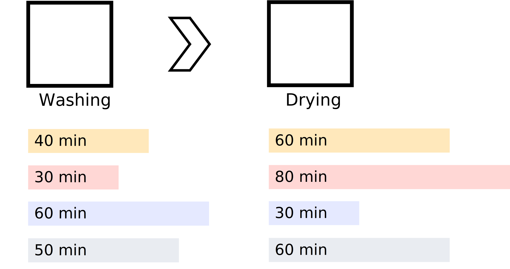
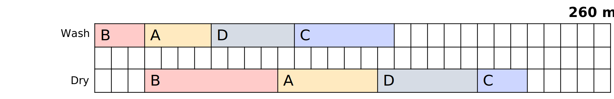
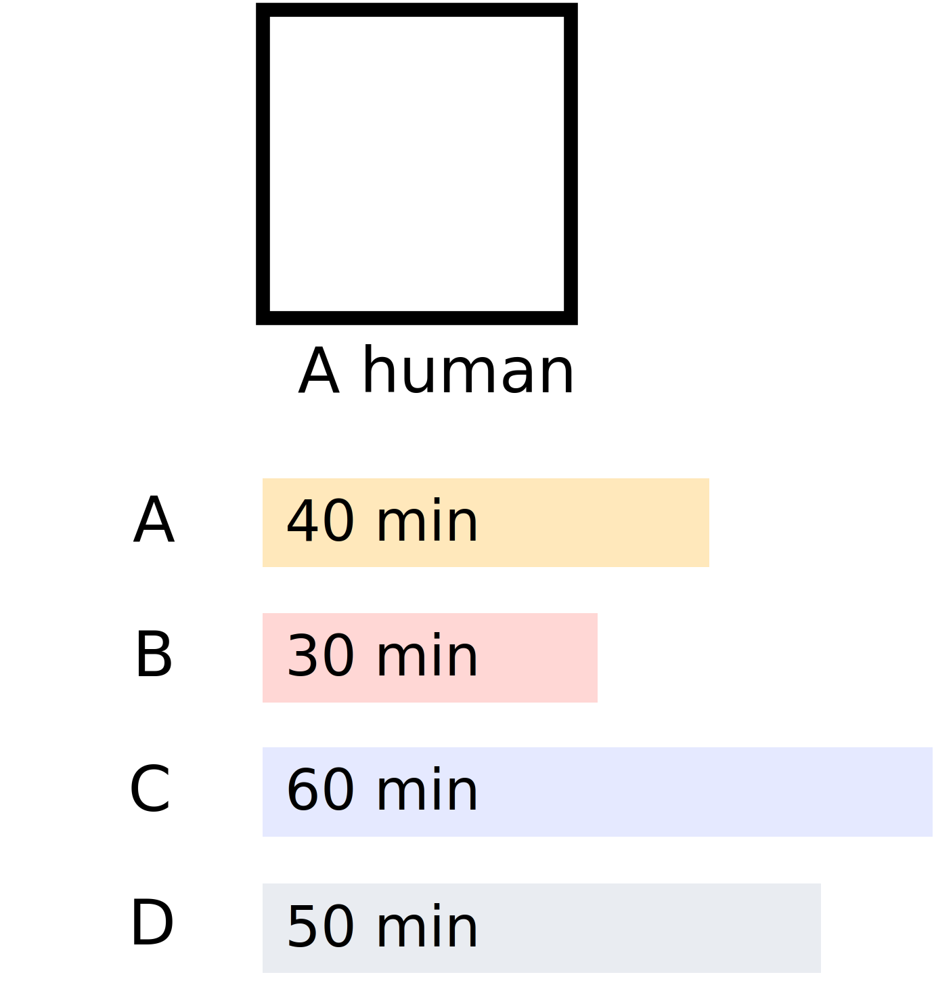
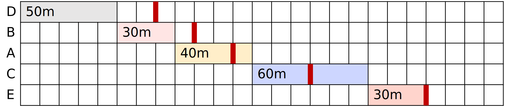
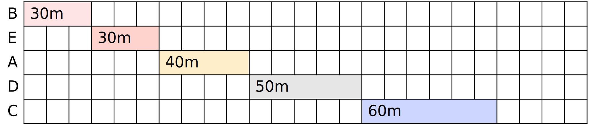
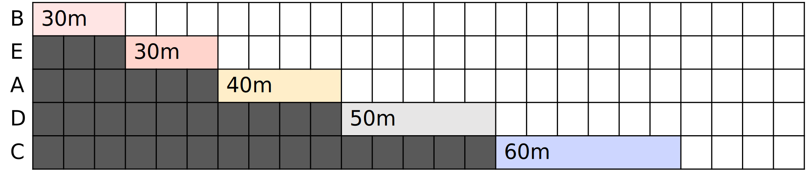
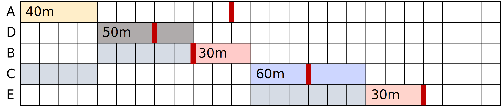
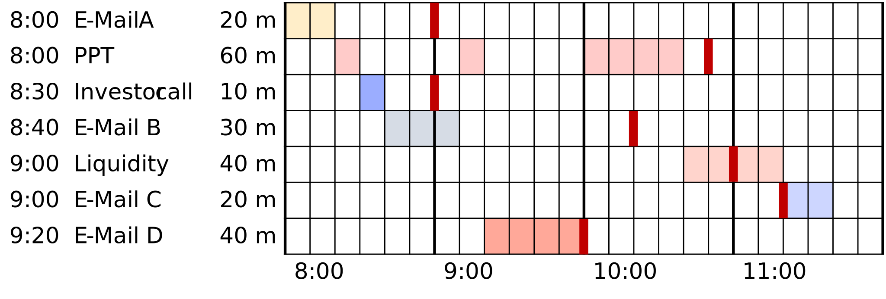
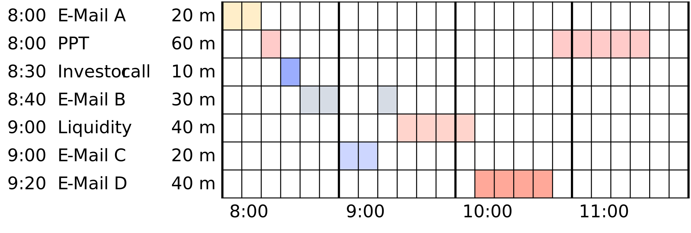
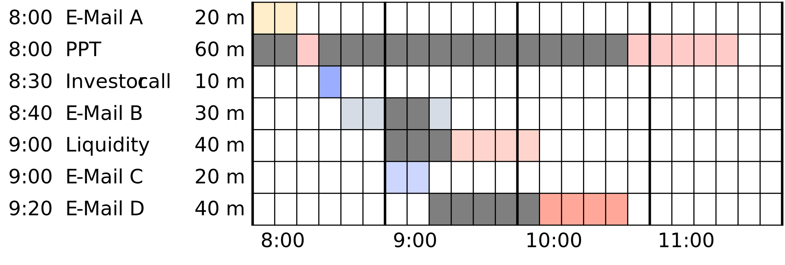

<script  src="../site_libs/quarto-diagram/mermaid.min.js"></script>
<script  src="../site_libs/quarto-diagram/mermaid-init.js"></script>
<link  href="../site_libs/quarto-diagram/mermaid.css" rel="stylesheet" />

# <span class="flow">Introduction</span>

## Today's Topic: Scheduling Algorithms

**Topic:** Understanding scheduling problems and algorithmic solutions for optimal task ordering

. . .

**Why this matters:** Every day you make scheduling decisions, from organizing your to-do list to managing projects. Today we'll learn the mathematical algorithms that can optimize these decisions and see how they connect to programming logic.

## Today's Agenda

1.  **Scheduling Fundamentals** - Johnson's Rule and two-machine problems
2.  **Historical Context** - How scheduling theory developed
3.  **Core Algorithms** - EDD for deadlines, SPT for efficiency
4.  **Advanced Topics** - Dependencies, real-time scheduling, thrashing
5.  **Programming Connections** - How this builds algorithmic problem-solving skills

# <span class="flow">Scheduling Fundamentals</span>

## A Simple Scheduling Problem



## Washing Machine & Dryer

Let's solve this simple scheduling problem:

. . .

``` python
Task  Washing  Drying
  A    40min   60min
  B    30min   80min
  C    60min   20min
  D    50min   60min
```

. . .

<span class="highlight">Goal:</span> **Minimize total time for washing and drying all loads**

. . .

<span class="question">Question:</span> **An idea how to solve this?**

## Johnson's Rule

<span class="task">Rule:</span> To find the <span class="highlight">optimal solution</span>:

1.  Find the job with **shortest duration**:
    - If on **Machine 1** → Schedule First
    - If on **Machine 2** → Schedule Last
    - If **equal** → Choose randomly
2.  Remove job from list and **repeat**

## Applying Johnson's Rule

``` python
Task  Washing  Drying  Schedule
  A    40min   60min
  B    30min   80min
  C    60min   20min
  D    50min   60min
```

. . .

<span class="question">Question:</span> **What's the first scheduled task?**

## Applying Johnson's Rule

``` python
Task  Washing  Drying  Schedule
  A    40min   60min
  B    30min   80min
  C    60min   20min        4
  D    50min   60min
```

- **In Task C**, the dryer is the **shortest** task.
- It is on **Machine 2** → **Schedule Last**

. . .

<span class="question">Question:</span> **What's the next task?**

## Applying Johnson's Rule

``` python
Task  Washing  Drying  Schedule
  A    40min   60min
  B    30min   80min        1
  C    60min   20min        4
  D    50min   60min
```

- **In Task B**, the washing machine is the **shortest** task.
- It is on **Machine 1** → **Schedule First**

. . .

<span class="question">Question:</span> **What's the next task?**

## Applying Johnson's Rule

``` python
Task  Washing  Drying  Schedule
  A    40min   60min        2
  B    30min   80min        1
  C    60min   20min        4
  D    50min   60min
```

- **In Task A**, the washing machine is the **shortest** task.
- It is on **Machine 1** → **Schedule Second**

. . .

<span class="highlight">Now, we only have one task left!</span>

## Applying Johnson's Rule

``` python
Task  Washing  Drying  Schedule
  A    40min   60min        2
  B    30min   80min        1
  C    60min   20min        4
  D    50min   60min        3
```

. . .

**Final sequence: <span class="highlight">B A D C</span>**

## Optimal Solution

**Optimal Solution: <span class="highlight">B A D C</span>**



<!--

::::::{.cell layout-align="default"}

:::::{.cell-output-display}

::::{}
`<figure class=''>`{=html}

:::{}

<pre class="mermaid mermaid-js">
gantt
    title Optimal Schedule
    dateFormat HH:mm
    axisFormat %H:%M

    section Washing
        Wash B : 00:00, 30m
        Wash A : 40m
        Wash D : 50m
        Wash C : 60m

    section Drying
        Dry B : 00:30, 80m
        Dry A : 60m
        Dry D : 60m
        Dry C : 20m
</pre>
:::
`</figure>`{=html}
::::
:::::
::::::
-->

**Total time:** 4 hours 20 minutes

. . .

<span class="question">Question:</span> **Is there a worse solution?**

## Suboptimal Solution

**Suboptimal Solution: <span class="highlight">C D A B</span>**


<!--

::::::{.cell layout-align="default"}

:::::{.cell-output-display}

::::{}
`<figure class=''>`{=html}

:::{}

<pre class="mermaid mermaid-js">gantt
    title Suboptimal Schedule
    dateFormat HH:mm
    axisFormat %H:%M

    section Washing
    Wash C : 00:00, 60m
    Wash D : 50m
    Wash A : 40m
    Wash B : 60m

    section Drying
    Dry C : 01:00, 20m
    Dry D : 01:50, 60m
    Dry A : 60m
    Dry B : 80m
</pre>
:::
`</figure>`{=html}
::::
:::::
::::::
-->

**Total time:** 5 hours 10 minutes

. . .

<span class="question">Question:</span> **What's the difference?**

# <span class="flow">History</span>

## <span class="invert-font">Industrial Revolution</span>

. . .

- First systematic visualization by Frederick Taylor
- Henry Gantt develops the Gantt Chart around 1910
- Key tool during Industrial Revolution
- But no scheduling theory yet!

. . .

<span class="highlight">Question:</span> **Who knows what a Gantt Chart is?**

## <span class="invert-font">Modern Scheduling Theory</span>

. . .

- RAND Corporation founded (1948)
- Selmer Johnson publishes Johnson's Rule in 1954
- Beginning of modern scheduling theory
- Many more algorithms and methods developed since

## Professional Applications

**Where do we see scheduling in professional practice?**

- **Project Management:** Task dependencies, resource allocation
- **Software Development:** CPU, thread management, job queues
- **Operations:** Production, supply chain optimization
- **Healthcare:** Patients, surgery planning, staff allocation
- **Transportation:** Routes, crews, maintenance

. . .

**Connection to Programming:** These are the same optimization problems that algorithms solve!

# <span class="flow">Scheduling Tasks</span>

## Task Classification

<span class="question">Question:</span> **What properties can scheduled tasks have?**

. . .

<figure class=''>

<pre class="mermaid mermaid-js">mindmap
  root((Task Properties))
    Time-Related
      Time windows
      Deadlines
      Start constraints
      Deterministic durations
      Variable durations
      Stochastic durations
    Relationship-Based
      Predecessor relationships
      Successor relationships
      Dependencies
      Priority levels
      Resource constraints
</pre>

</figure>

. . .

<span class="question">Question:</span> **What types of tasks do you deal with most often?**

## Single Machine Scheduling



<span class="question">Question:</span> **What is different from before?**

## Order is Irrelevant

> **Order is Irrelevant**
>
> Under simple minimization of total processing time, **order doesn't matter!**

. . .

<span class="question">Question:</span> **But is it that simple?**

. . .

> **Order Matters**
>
> Order becomes crucial when we consider, **Deadlines, Priorities and Dependencies!**

# <span class="flow">Deadlines</span>

## Earliest Due Date (EDD)

Tasks with individual deadlines:

``` python
Task  Duration  Deadline
  A    40min    110min
  B    30min     90min
  C    60min    150min
  D    50min     70min
  E    30min    210min
```

. . .

<span class="highlight">Goal:</span> **Minimize maximum deadline violation**

. . .

<span class="question">Question:</span> **An idea how to solve this?**

## EDD Solution

<span class="task">Rule:</span> Sort the tasks by deadline.

``` python
Task  Duration  Deadline
  A    40min    110min
  B    30min     90min
  C    60min    150min
  D    50min     70min
  E    30min    210min
```

. . .

``` python
Task  Duration  Deadline
  D    50min     70min
  B    30min     90min
  A    40min    110min
  C    60min    150min
  E    30min    210min
```

. . .

<span class="highlight">Let's visualize this!</span>

## EDD Schedule



<!--

::::::{.cell layout-align="default"}

:::::{.cell-output-display}

::::{}
`<figure class=''>`{=html}

:::{}

<pre class="mermaid mermaid-js">gantt
    title EDD Schedule
    dateFormat HH:mm
    axisFormat %H:%M

    section Tasks
        D: 00:00, 50m
        B: 30m
        A: 40m
        C: 60m
        E: 30m

    section Deadline
        D: 00:00, 70m
        B: 00:00, 90m
        A: 00:00, 110m
        C: 00:00, 150m
        E: 00:00, 210m
</pre>
:::
`</figure>`{=html}
::::
:::::
::::::
-->

. . .

<span class="question">Question:</span> **What's the maximum delay here?**

# <span class="flow">Processing Time</span>

## Shortest Processing Time (SPT)


Instead of deadlines, we now have **processing times.**

<span class="fragment"><span class="highlight">Goal:</span> Min. total waiting time</span>

<span class="fragment"><span class="question">Question:</span> **Any ideas?**</span>

<span class="fragment"><span class="task">Rule:</span> Always schedule the shortest remaining task</span>

## Shortest Processing Time Applied

<span class="task">Rule:</span> Always schedule the **shortest remaining task**. Choose random if multiple tasks are tied.

``` python
Task  Duration  Schedule
  A    40min
  B    30min
  C    60min
  D    50min
  E    30min
```

. . .

<span class="question">Question:</span> **What's the order of scheduled tasks?**

## Shortest Processing Time Applied

<span class="task">Rule:</span> Always schedule the **shortest remaining task**. Choose random if multiple tasks are tied.

``` python
Task  Duration  Schedule
  A    40min        3
  B    30min        1
  C    60min        5
  D    50min        4
  E    30min        2
```

. . .

**Final sequence: <span class="highlight">B E A D C</span> or <span class="highlight">E B A D C</span>**

## SPT Solution

**Optimal sequence:**



<!--

::::::{.cell layout-align="default"}

:::::{.cell-output-display}

::::{}
`<figure class=''>`{=html}

:::{}

<pre class="mermaid mermaid-js">gantt
    title SPT Schedule
    dateFormat HH:mm
    axisFormat %H:%M

    section Tasks
    B (30min) : 00:00, 30m
    E (30min) : 30m
    A (40min) : 40m
    D (50min) : 50m
    C (60min) : 60m
</pre>
:::
`</figure>`{=html}
::::
:::::
::::::
-->

. . .

<span class="question">Question:</span> **Where can we see the waiting time?**

## SPT Waiting Time

<span class="highlight">Total waiting time:</span> 340 minutes



. . .

<span class="question">Question:</span> **Would this be applicable for your work?**

## Weighted SPT

- <span class="highlight">Change:</span> Tasks with **additional priorities**
- Priorities could be, e.g., revenue if we are consultants.

``` python
Task  Duration  Revenue
  A    20min    €240
  B    30min    €200
  C    60min    €120
  D    50min    €70
  E    30min    €130
  F    40min    €120
  G    20min    €100
  H    70min    €110
  I    50min    €90
```

. . .

<span class="question">Question:</span> **Any ideas how to approach this?**

## Gain/Revenue Per Minute

<span class="task">Rule:</span> Schedule by revenue per minute (descending)

``` python
Task  Duration  Revenue  Revenue/Min  Schedule
  A    20min    €240     12.0
  B    30min    €200      6.7
  C    60min    €120      2.0
  D    50min    €70       1.4
  E    30min    €130      4.3
  F    40min    €120      3.0
  G    20min    €100      5.0
  H    70min    €110      1.6
  I    50min    €90       1.8
```

. . .

<span class="question">Question:</span> **What's the order of scheduled tasks?**

## Gain/Revenue Per Minute

<span class="task">Rule:</span> Schedule by revenue per minute (descending)

``` python
Task  Duration  Revenue  Revenue/Min  Schedule
  A    20min    €240     12.0           1
  B    30min    €200      6.7
  C    60min    €120      2.0
  D    50min    €70       1.4
  E    30min    €130      4.3
  F    40min    €120      3.0
  G    20min    €100      5.0
  H    70min    €110      1.6
  I    50min    €90       1.8
```

## Gain/Revenue Per Minute

<span class="task">Rule:</span> Schedule by revenue per minute (descending)

``` python
Task  Duration  Revenue  Revenue/Min  Schedule
  A    20min    €240     12.0           1
  B    30min    €200      6.7           2
  C    60min    €120      2.0
  D    50min    €70       1.4
  E    30min    €130      4.3
  F    40min    €120      3.0
  G    20min    €100      5.0
  H    70min    €110      1.6
  I    50min    €90       1.8
```

## Gain/Revenue Per Minute

<span class="task">Rule:</span> Schedule by revenue per minute (descending)

``` python
Task  Duration  Revenue  Revenue/Min  Schedule
  A    20min    €240     12.0           1
  B    30min    €200      6.7           2
  C    60min    €120      2.0
  D    50min    €70       1.4
  E    30min    €130      4.3
  F    40min    €120      3.0
  G    20min    €100      5.0           3
  H    70min    €110      1.6
  I    50min    €90       1.8
```

## Gain/Revenue Per Minute

<span class="task">Rule:</span> Schedule by revenue per minute (descending)

``` python
Task  Duration  Revenue  Revenue/Min  Schedule
  A    20min    €240     12.0           1
  B    30min    €200      6.7           2
  C    60min    €120      2.0
  D    50min    €70       1.4
  E    30min    €130      4.3           4
  F    40min    €120      3.0
  G    20min    €100      5.0           3
  H    70min    €110      1.6
  I    50min    €90       1.8
```

## Gain/Revenue Per Minute

<span class="task">Rule:</span> Schedule by revenue per minute (descending)

``` python
Task  Duration  Revenue  Revenue/Min  Schedule
  A    20min    €240     12.0           1
  B    30min    €200      6.7           2
  C    60min    €120      2.0
  D    50min    €70       1.4
  E    30min    €130      4.3           4
  F    40min    €120      3.0           5
  G    20min    €100      5.0           3
  H    70min    €110      1.6
  I    50min    €90       1.8
```

## Gain/Revenue Per Minute

<span class="task">Rule:</span> Schedule by revenue per minute (descending)

``` python
Task  Duration  Revenue  Revenue/Min  Schedule
  A    20min    €240     12.0           1
  B    30min    €200      6.7           2
  C    60min    €120      2.0           6
  D    50min    €70       1.4
  E    30min    €130      4.3           4
  F    40min    €120      3.0           5
  G    20min    €100      5.0           3
  H    70min    €110      1.6
  I    50min    €90       1.8
```

## Gain/Revenue Per Minute

<span class="task">Rule:</span> Schedule by revenue per minute (descending)

``` python
Task  Duration  Revenue  Revenue/Min  Schedule
  A    20min    €240     12.0           1
  B    30min    €200      6.7           2
  C    60min    €120      2.0           6
  D    50min    €70       1.4
  E    30min    €130      4.3           4
  F    40min    €120      3.0           5
  G    20min    €100      5.0           3
  H    70min    €110      1.6
  I    50min    €90       1.8           7
```

## Gain/Revenue Per Minute

<span class="task">Rule:</span> Schedule by revenue per minute (descending)

``` python
Task  Duration  Revenue  Revenue/Min  Schedule
  A    20min    €240     12.0           1
  B    30min    €200      6.7           2
  C    60min    €120      2.0           6
  D    50min    €70       1.4
  E    30min    €130      4.3           4
  F    40min    €120      3.0           5
  G    20min    €100      5.0           3
  H    70min    €110      1.6           8
  I    50min    €90       1.8           7
```

## Gain/Revenue Per Minute

<span class="task">Rule:</span> Schedule by revenue per minute (descending)

``` python
Task  Duration  Revenue  Revenue/Min  Schedule
  A    20min    €240     12.0           1
  B    30min    €200      6.7           2
  C    60min    €120      2.0           6
  D    50min    €70       1.4           9
  E    30min    €130      4.3           4
  F    40min    €120      3.0           5
  G    20min    €100      5.0           3
  H    70min    €110      1.6           8
  I    50min    €90       1.8           7
```

. . .

> **Metric Priorities**
>
> Without revenues, we can use the same approach with **metric priorities**!

# <span class="flow">Dependencies</span>

## Priority Inversion

**Setup:**

``` python
Task  Duration  Priority
  A    20min     3
  B    30min     1
  C    30min     2
  D    30min     2
  E    30min     2
```


<span class="fragment">**Challenge:**
High-priority tasks depend on low-priority tasks.</span>

<span class="fragment"><span class="highlight">Risk:</span> Priority inversion can lead to significant delays!</span>

<span class="fragment center"></span>

## Priority Inheritance

<span class="question">Question:</span> **How to handle with shortest processing time?**

- <span class="task">Rule:</span> Tasks inherit priority from their dependents.
- A gets the highest priority from B
- This ensures the **critical path completion**

. . .

``` python
Task  Duration  Priority
  A    20min     3
  B    30min     3
  C    30min     2
  D    30min     2
  E    30min     2
```

## EDD and Dependencies

<span class="question">Question:</span> **What's was earliest due date again?**

. . .

- Sort the tasks by deadline, schedule equal tasks randomly
- Things get more complex when we add dependencies

. . .

``` python
Task  Duration  Deadline  Predecessor
  A    40min    110min    None
  B    30min     90min    D
  C    60min    150min    A
  D    50min     70min    None
  E    30min    210min    C
```

<span class="question">Question:</span> **Any ideas how to solve this?**

## Lawler's Algorithm

<span class="task">Rule:</span> We can use **Lawler's Algorithm** (1968)

1.  Consider all tasks <span class="highlight">without successors</span>
2.  Choose the one with **latest deadline**
3.  Schedule the task **last**
4.  **Remove** it from the network and start again

## Lawler's Applied

``` python
Task  Duration  Deadline  Predecessor Schedule
  A    40min    110min    None
  B    30min     90min    D
  C    60min    150min    A
  D    50min     70min    None
  E    30min    210min    C
```

. . .

<span class="question">Question:</span> **What's the schedule?**

## Lawler's Applied

``` python
Task  Duration  Deadline  Predecessor Schedule
  A    40min    110min    None
  B    30min     90min    D
  C    60min    150min    A
  D    50min     70min    None
  E    30min    210min    C             5
```

## Lawler's Applied

``` python
Task  Duration  Deadline  Predecessor Schedule
  A    40min    110min    None
  B    30min     90min    D
  C    60min    150min    A             4
  D    50min     70min    None
  E    30min    210min    C             5
```

## Lawler's Applied

``` python
Task  Duration  Deadline  Predecessor Schedule
  A    40min    110min    None          3
  B    30min     90min    D
  C    60min    150min    A             4
  D    50min     70min    None
  E    30min    210min    C             5
```

## Lawler's Applied

``` python
Task  Duration  Deadline  Predecessor Schedule
  A    40min    110min    None          3
  B    30min     90min    D             2
  C    60min    150min    A             4
  D    50min     70min    None
  E    30min    210min    C             5
```

## Lawler's Applied

``` python
Task  Duration  Deadline  Predecessor Schedule
  A    40min    110min    None          3
  B    30min     90min    D             2
  C    60min    150min    A             4
  D    50min     70min    None          1
  E    30min    210min    C             5
```

. . .

> **Successor Tasks**
>
> Note, how all tasks become tasks without successors at some point.

## Lawler's Solution



> **Predecessor Tasks**
>
> Predecessor tasks are tasks that must be completed before the current task can start. They are marked in grey in the chart.

. . .

<span class="question">Question:</span> **What's the maximum delay?**

# <span class="flow">Difficulty of Scheduling</span>

## SPT with Predecessors

- No solution in **polynomial time**
- <span class="highlight">NP-hard problem</span> (no efficient algorithm)
- True for **most scheduling problems!**
- We can use **heuristics**, though

. . .

<span class="question">Question:</span> **What have we missed so far?**

# <span class="flow">Real-time Scheduling</span>

## Interruptions

- In reality, we **cannot predict the future**
- We need to react to **new tasks** as they happen
- If we have a **deadline**, we might need to meet it
- Let's look at this for the <span class="highlight">earliest due date objective</span>

. . .

> **Quick reminder**
>
> An earliest due date is a specific point in time by which a task must be completed. Under this objective, we want to minimize the **maximum delay**.

## Real-time EDD

8:00-12:00 Schedule:

``` python
Task           Duration  Deadline
Email A        20min     9:00
Create PPT     60min    10:50
Investor call  10min     9:00
Email B        30min    10:20
Liquidity      40min    11:00
Email C        20min    11:20
Email D        40min    10:00
```

. . .

<span class="question">Question:</span> **Any ideas how to start with under the objective of the earliest due date?**

## EDD Rule for Real-time

<span class="task">Rule:</span>

- Always schedule the task with the **earliest deadline**
- If a new task with an earlier deadline comes in, **re-schedule**
- Otherwise, stick to the original schedule.

. . .

> **Equal Deadline**
>
> If a new task has the same deadline as the current task, you can choose either. But due to the cost of context switching, you might want to stick with the current task.

## EDD Solution for Real-time



. . .

<span class="question">Question:</span> **What's the maximum delay with this schedule?**

## SPT for Real-time

> **Quick reminder**
>
> A shortest processing time is the task with the shortest duration. Under this objective, we want to minimize the **total waiting time**.

. . .

<span class="question">Question:</span> **Any ideas how to start here?**

## SPT Rule for Real-time

<span class="task">Rule:</span>

- Always schedule the task with the **shortest duration**
- If a new task with a shorter duration comes in, **re-schedule**
- Otherwise, stick to the original schedule.

. . .

> **Equal Duration**
>
> If a new task has the same duration as the current task, you can choose either. But due to the cost of context switching, you might again want to stick with the current task.

## SPT Solution for Real-time



. . .

<span class="question">Question:</span> **Where can we see the waiting time?**

## SPT Solution for Real-time



<span class="highlight">Total waiting time:</span> 260 minutes

# <span class="flow">Thrashing</span>

## What is Thrashing?

- Excessive **context switching**
- Organization <span class="highlight">overhead exceeds productivity</span>
- Maximum activity, minimum output

. . .

<span class="question">Question:</span> **Have you ever experienced this?**

## Thrashing Warning Signs

- Constant **task switching**
- **Nothing** getting completed
- Increasing **stress levels**
- Declining **quality**

. . .

<span class="question">Question:</span> **Any ideas how to prevent this?**

## Preventing Thrashing Strategic

> **Strategic**
>
> Strategic solutions focus on **long-term** changes to prevent thrashing.

. . .

1.  Task rejection/delegation threshold
2.  Simplified organization systems
3.  Minimum work period rules
4.  Reduced reactivity requirements

## Preventing Thrashing Tactical

1.  Time blocking
2.  Focus periods
3.  Task batching
4.  Priority freezes

. . .

<span class="question">Question:</span> **What strategies have worked for you?**

# <span class="flow">Applying This Knowledge</span>

## Immediate Applications

**How can you use these algorithms starting today?**

- **Daily planning:** Use SPT for your to-do list to minimize waiting time
- **Project management:** Apply EDD when managing deadlines
- **Team coordination:** Use Johnson's Rule for two-stage processes
- **Time blocking:** Prevent thrashing with strategic scheduling

## Key Takeaways

**What we learned today:**

1.  **Scheduling algorithms** provide optimal solutions to time management problems
2.  **Different objectives** require different algorithms
3.  **Dependencies and constraints** add complexity but have algorithmic solutions
4.  **Thrashing prevention** is crucial for productivity
5.  **These principles** directly translate to programming and system design

## 

Any questions

so far?

## After the break --- Scheduling

- Programming session in our new notebooks
- How to translate the idea into code and experiments
- Different scheduling algorithms applied to problems

. . .

> **Note**
>
> **That's it for scheduling!**  
> Let's have a short break and then continue with our fourth Python programming session.

# <span class="flow">Literature</span>

## Interesting literature to start

- Christian, B., & Griffiths, T. (2016). Algorithms to live by: the computer science of human decisions. First international edition. New York, Henry Holt and Company.[^1]

## Books on Programming

- Downey, A. B. (2024). Think Python: How to think like a computer scientist (Third edition). O'Reilly. [Here](https://greenteapress.com/wp/think-python-3rd-edition/)
- Elter, S. (2021). Schrödinger programmiert Python: Das etwas andere Fachbuch (1. Auflage). Rheinwerk Verlag.

## Questions & Discussion

> **Note**
>
> Think Python is a great book to start with. It's available online for free. Schrödinger Programmiert Python is a great alternative for German students, as it is a very playful introduction to programming with lots of examples.

## More Literature

For more interesting literature, take a look at the [literature list](../general/literature.qmd) of this course.

[^1]: The main inspiration for this lecture. Nils and I have read it and discussed it in depth, always wanting to translate it into a course.
